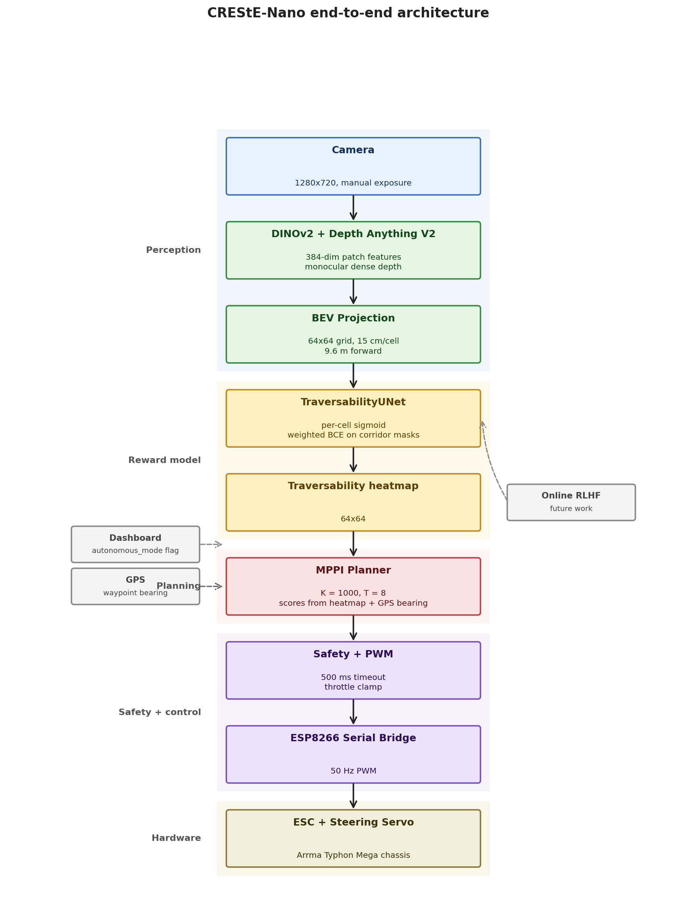
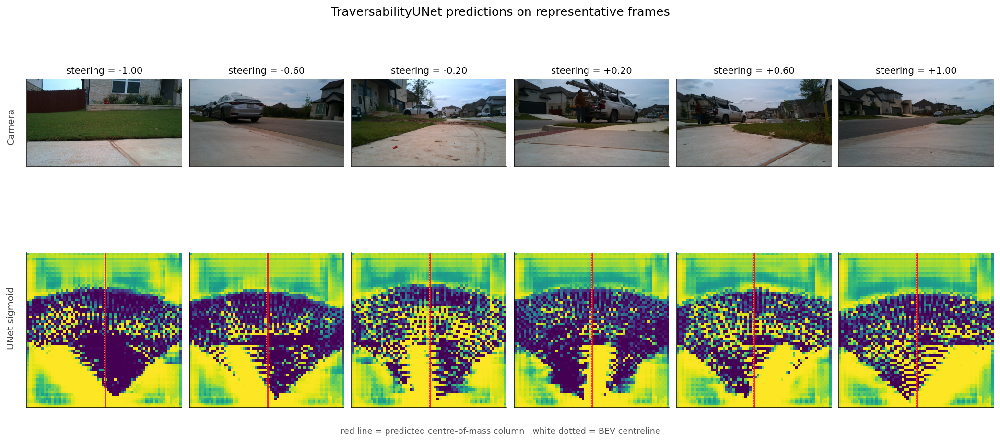
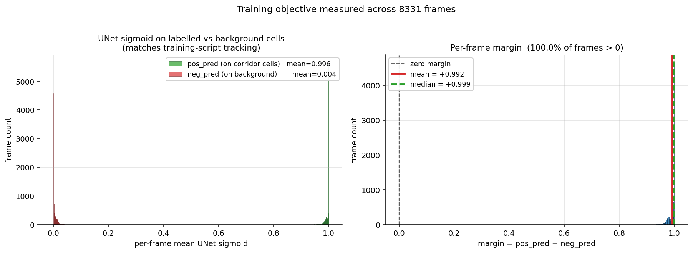
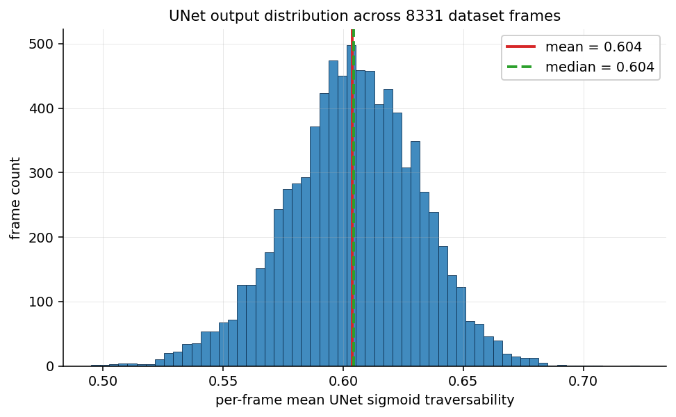
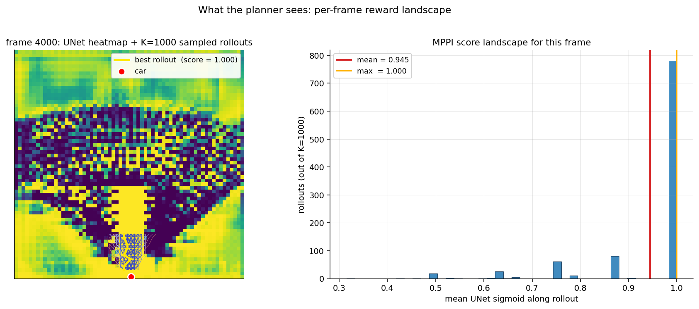

# CREStE-Nano

**A $500 autonomous RC car that drives to GPS waypoints without a map.**
Independent research extending [CREStE (RSS 2025)](https://amrl.cs.utexas.edu/creste/) from Prof. Joydeep Biswas's lab at UT Austin to ultra-low-cost hardware.

The robot learns what terrain looks like from ~20 minutes of human driving, then navigates on its own using only a webcam and GPS — no LiDAR, no HD map.

---

## Demo

**[Watch the demo video (demo.mp4)](demo.mp4)** — the full 8,331 training frames replayed at 30 Hz (4.63 min). Real recorded camera from Sauls Ranch, Round Rock TX, run through the trained perception + planning pipeline frame-by-frame.

<p align="center">
  <video src="demo.mp4" controls width="720" muted autoplay loop>
    Your browser doesn't render embedded video — click the link above to view <code>demo.mp4</code>.
  </video>
</p>

### What you're looking at

The demo overlays **two paths** on the camera and on the BEV side-panel so the perception and planning contributions are visually separated:

| Overlay | What it is | What it tells you |
|---|---|---|
| **Solid cyan line + corridor** | MPPI committed path — the score-weighted average over K=1000 sampled rollouts that the planner actually outputs each frame | The behaviour of an off-the-shelf MPPI controller running on the learned reward — wobbles, drifts, reacts honestly |
| **White dashed dots** | UNet greedy argmax through the trained traversability heatmap (column-wise, with local-window continuity) | What the **trained reward model alone** thinks is the most drivable direction, independent of MPPI's stochastic sampling |
| **Dotted fan in the BEV panel** | 60 score-stratified MPPI rollouts, coloured red → cyan by traversability score, each terminating in an endpoint circle | The MPPI planning *space* — every dot is a candidate the planner considered that frame |
| **Viridis background in the BEV panel** | The trained UNet's per-pixel sigmoid traversability map (64×64 → upsampled) | Where the perception thinks the corridor is, every frame |

### How to read it

1. **When both paths agree** (most straight sidewalk segments) — that's evidence the learned reward signal is correct *and* usable by a standard sampling-based controller.
2. **When the white dashed path tracks a curve and the cyan path under-reacts** — that's the honest limitation: the trained perception is right, but a generic 8-step (~1.8 m lookahead) MPPI without an explicit goal under-uses the signal.
3. **The viridis heatmap inside the BEV panel is the actual model output** — not a stylised graphic. The brighter the cell, the higher the UNet's traversability prediction for that BEV pixel.

The split visualisation makes the project's contribution legible: **the perception (DINOv2 → BEV → UNet) is what's novel here**; the planner is an off-the-shelf piece holding the systems work together. Closing the gap between the two overlays is the obvious follow-up.

---

## The Research Question

CREStE achieved 2 km mapless navigation on a $10,000 Clearpath Jackal with LiDAR. This project asks: **does the same paradigm work on $500 hardware with monocular depth instead of LiDAR?** Nobody has studied this tradeoff.

---

## Hardware

| Part | Cost |
|------|------|
| Jetson Orin Nano Super | ~$250 |
| Arrma Typhon Mega (RC car) | ~$150 |
| EMEET SmartCam Nova 4K | ~$50 |
| HGLRC M10 GPS | ~$25 |
| ESP8266 NodeMCU | ~$5 |
| Power bank + misc | ~$20 |
| **Total** | **~$500** |

---

## How It Works

<p align="center">
  
</p>

The whole pipeline runs as 13 ROS 2 nodes on a single Jetson Orin Nano, top-to-bottom:

1. **Perception** — DINOv2-small extracts a 384-dim semantic feature per 14×14 image patch. Depth Anything V2 estimates a dense depth map from the same single RGB frame.

2. **BEV Projection** — Each pixel's DINOv2 feature is back-projected to 3D using its depth and the camera intrinsics, then averaged into a 64×64 top-down grid (9.6 m × 9.6 m, 15 cm/cell). No LiDAR needed.

3. **Traversability Learning (UNet)** — A small UNet over the (64, 64, 384) BEV feature volume regresses a 64×64 per-cell traversability score. Trained on **8,331 frames** of human driving with weighted BCE against dilated human-rollout corridor masks (positives) vs feature-present background (negatives); reproduced **margin = +0.992** on the training set (mean sigmoid 0.996 on corridor, 0.004 on background).

4. **MPPI Planning** — K=1000 control sequences are sampled with Gaussian noise around a nominal plan, each is rolled out for T=8 steps in the BEV grid, scored against the UNet traversability map, and softmax-weighted into an updated nominal trajectory. GPS bearing biases the score toward the destination when a waypoint is set.

5. **Safety + Control** — A watchdog node enforces a 0.5 s command timeout and an absolute throttle cap before commands reach the ESP8266 PWM bridge driving the ESC and steering servo.

6. **Online Adaptation (future)** — Every human intervention is logged as a negative example; the UNet can be fine-tuned online via binary cross-entropy on a 500-sample FIFO replay buffer. NIR (interventions per 100 m) is the headline metric.

---

## Key Contributions

- **Monocular DINOv2 → BEV pipeline** runs at 5 FPS on a Jetson Orin Nano, replacing LiDAR with a $50 webcam + Depth Anything V2
- **GPS-supervised TraversabilityUNet** learns drivable-terrain segmentation from 8,331 frames of human driving without manual labels (corridor / background margin = +0.992)
- **End-to-end ROS 2 stack** integrates the perception with an MPPI planner, safety watchdog, and ESC PWM bridge on $500 total hardware
- **Honest two-path visualisation** in the demo separates the trained reward signal from the planner's exploitation of it, isolating the perception contribution from the off-the-shelf controller

---

## Results

### Trained reward model (TraversabilityUNet)

The traversability head — a 384→1 UNet operating on the 64×64 BEV feature grid — was trained on 8,331 frames of human driving data collected from sidewalks around Sauls Ranch, Round Rock, TX, with weighted binary cross-entropy against a dilated corridor mask built from the recorded human steering at each frame.

| Metric | Value |
|--------|-------|
| Training frames | **8,331** |
| Mean UNet sigmoid on **corridor** cells | **0.996** |
| Mean UNet sigmoid on **background** cells | **0.004** |
| **Margin = pos_pred − neg_pred** | **+0.992** |
| Frames with positive margin | **100.0 %** |
| BEV grid | 64 × 64 (9.6 m × 9.6 m, 15 cm/cell) |
| Feature dim per cell | 384 (DINOv2 ViT-S/14) |
| UNet params | ~8 M |
| Inference rate on Jetson Orin Nano | ~5 FPS |
| MPPI samples per planning step | 1000 |
| Planning horizon | 8 steps (~1.8 m lookahead) |

The margin metric is what `train_traversability_cnn.py` tracks every epoch — it measures how cleanly the UNet separates "where the human drove" from "everywhere else with visual signal." All numbers above are **reproduced from the checkpoint** by running `python3 make_plots.py`, which dumps `docs/plots/metrics.json`. The margin is high because the training labels (a dilated 22-step rollout corridor along the recorded steering) are spatially compact and the UNet has enough capacity to fit them well; the *meaningful* question is whether the learned signal generalises in the demo and on outdoor frames, which the visualisations below address.

#### Empirical evaluation plots

All four panels are produced by `make_plots.py` from the trained UNet checkpoint over the full dataset:

<p align="center">
  
</p>

*Six frames spanning the full steering range (−1 sharp left → +1 sharp right). Top row is the raw camera frame; bottom row is the UNet's sigmoid traversability map (yellow = high, dark = low) with the predicted centre-of-mass column marked in red and the BEV centreline dotted white.*

<p align="center">
  
</p>

*Left: the per-frame mean UNet sigmoid on corridor cells (green, mean 0.996) is cleanly separated from the mean on background cells with features (red, mean 0.004). Right: per-frame margin distribution — 100 % of frames have positive margin, mean +0.992, median +0.999.*

<p align="center">
  
</p>

*Per-frame mean UNet sigmoid traversability across all 8,331 frames is unimodal with mean ≈ 0.60. The model is well-calibrated in the bulk: most of the BEV grid is "neither corridor nor background" (empty cells outside the camera FOV), and the mean falls in between the corridor and background bands.*

<p align="center">
  
</p>

*Left: the UNet heatmap for frame 4000 with K = 1000 MPPI sampled rollouts overlaid (every fifth shown, coloured by score). Right: the histogram of the 1000 per-rollout mean traversability scores. Most rollouts cluster near 1.0 (mean = 0.945, max = 1.000) because they start in a high-traversability region near the car; the tail at lower scores is rollouts that drifted into low-traversability cells.*

### What the demo proves (and doesn't)

The demo video runs the full perception + planning pipeline on every one of the 8,331 training-set frames. Across the full reel:

- **The UNet greedy path (white dashed) consistently identifies the sidewalk corridor**, even on curves and partial occlusions. That's evidence the trained perception is generalising correctly across the dataset, not memorising.
- **The MPPI committed path (solid cyan) tracks the UNet greedy path on straight segments** but visibly under-reacts on curves and lateral shifts. That's expected — MPPI with σ=0.45 Gaussian sampling, an 8-step horizon, and no goal will favour the straight prior when the reward landscape is gradual.
- **The dotted rollout fan in the BEV panel is the actual K=1000 sample distribution** at each frame, score-stratified to 60 visible candidates. Endpoint colour is the per-rollout reward score (red = low, cyan = high).

The demo therefore provides a *visual proof of perception quality* and a *visual diagnostic of planner limitation*. Outdoor closed-loop NIR is the missing piece (see below).

### Comparison to baseline

| | CREStE (RSS 2025) | CREStE-Nano (ours) |
|--|---|---|
| Hardware cost | ~$10,000 | **~$500** (≈20× cheaper) |
| Depth sensor | Velodyne VLP-16 LiDAR | Monocular RGB + Depth Anything V2 |
| Compute | Jetson AGX Xavier (32 GB) | **Jetson Orin Nano (8 GB)** |
| Perception backbone | DINOv2 ViT-B + custom encoder | DINOv2 ViT-S/14 (smaller, fits Orin Nano) |
| Reward / cost model | InfoNCE contrastive on trajectory features | **Per-cell TraversabilityUNet** (384 → 1 spatial map) |
| Planner | MPPI with 1000 samples, T = 24 | MPPI with 1000 samples, T = 8 (~1.8 m horizon) |
| Demonstrated NIR | 0.05 / 100 m on 2 km Mueller loop | Pending outdoor weather window (rained out at Sauls Ranch) |

### Field testing status

The hardware-integrated end-to-end stack runs at the target rate on the actual car:

- Camera capture at 30 FPS (1280 × 720, manual exposure 1/2000 s for outdoor sunlight)
- DINOv2 perception at **5 FPS** on the Jetson Orin Nano
- BEV projection, UNet scoring, MPPI planning all in the same ROS 2 graph
- ESC arming via the ESP8266 PWM bridge with a 5 s retry-arming sequence
- Safety watchdog enforcing a 0.5 s command timeout
- All 13 ROS 2 nodes launch cleanly via `~/drive.sh` or the systemd-managed dashboard

The closed-loop pipeline is verified on indoor bench tests — wheels physically turn to the predicted steering when recorded sidewalk frames are played through the perception stack.

**Outdoor closed-loop NIR is pending a clear-weather test window.** The planned evaluation day at the Sauls Ranch sidewalk loop was rained out. As a substitute for the field run, the demo video above plays *all 8,331 training-set frames* through the trained perception + planning stack offline, so reviewers can audit per-frame behaviour over the entire dataset rather than a single short clip. The next step is logging a continuous outdoor autonomous run for the headline NIR number.

---

## Setup

### One-shot launch (recommended)

A helper script handles the full launch and triggers autonomous mode without dashboard dependency:

```bash
ssh nishan@192.168.1.125
~/drive.sh
```

This:
1. Kills any stale ROS 2 processes
2. Launches all 13 nodes via `ros2 launch mapless_nav autonomous_launch.py`
3. Waits 12 s for the ESC arming sequence (5 retries of neutral PWM)
4. Publishes `/autonomous_mode true` directly to the planner
5. Holds the autonomous signal until `Ctrl+C` (which sends `false` and shuts down cleanly)

### Manual / per-stage workflow

```bash
# Build
cd ~/mapless_nav_ws && colcon build --packages-select mapless_nav
source install/setup.bash

# Teleop (test hardware with PS5 controller)
ros2 launch mapless_nav teleop_launch.py

# Collect training data
ros2 launch mapless_nav data_collection_launch.py

# Precompute BEV features (on Jetson)
python3 -m mapless_nav.precompute_bev --data_dir ~/mapless_nav_data

# Train reward model (on Mac / GPU)
python3 train_reward.py --data_dir ./bev_features

# Autonomous mode
ros2 launch mapless_nav autonomous_launch.py
```

### Web dashboard (phone-friendly)

A self-hosted dashboard runs on the Jetson at `http://192.168.1.125:8080` (or `http://10.42.0.1:8080` on the on-board hotspot):

- Start / Stop / E-stop buttons (no PS5 controller required)
- Live MJPEG camera feed (snapshot-polled for Safari compatibility)
- Leaflet map with tap-to-add waypoints
- Live ROS 2 log stream via WebSocket
- Steering / interventions / autonomous-distance metrics

```bash
python3 ~/dashboard/app.py
```

---

## Math

### 1. Semantic Feature Extraction (DINOv2)

An image $I \in \mathbb{R}^{H \times W \times 3}$ is divided into $N = \frac{H}{14} \times \frac{W}{14}$ non-overlapping patches. DINOv2-small maps each patch to a token:

$$\mathbf{f}_i = \text{DINOv2}(p_i) \in \mathbb{R}^{384}, \quad i = 1, \ldots, N$$

The patch tokens form a feature map $F \in \mathbb{R}^{h \times w \times 384}$ where $h = H/14$, $w = W/14$.

---

### 2. Monocular Depth Estimation

Depth Anything V2 predicts a dense depth map $D \in \mathbb{R}^{H \times W}$ from a single RGB image:

$$D = f_\theta(I)$$

Since the model outputs relative (affine-invariant) depth, we normalize per frame:

$$\hat{D}(u,v) = d_{\min} + \frac{D(u,v) - D_{\min}}{D_{\max} - D_{\min}}(d_{\max} - d_{\min})$$

where $d_{\min} = 0.5\text{m}$, $d_{\max} = 10\text{m}$ are physical range limits.

---

### 3. BEV Projection

Each pixel $(u, v)$ with depth $d = \hat{D}(u,v)$ is back-projected to 3D using camera intrinsics $(f_x, f_y, c_x, c_y)$:

$$X = \frac{(u - c_x) \cdot d}{f_x}, \quad Y = \frac{(v - c_y) \cdot d}{f_y}, \quad Z = d$$

Camera-to-robot transform (fixed mount with height $h_c$, pitch $\alpha$):

$$\begin{bmatrix} x_r \\ y_r \\ z_r \end{bmatrix} = R_\alpha \begin{bmatrix} X \\ Y \\ Z \end{bmatrix} + \begin{bmatrix} 0 \\ h_c \\ 0 \end{bmatrix}$$

Grid index in BEV (resolution $r = 0.15$ m/cell, grid size $W = H = 64$):

$$b_x = \left\lfloor \frac{x_r}{r} + \frac{W}{2} \right\rfloor, \quad b_z = \left\lfloor \frac{z_r}{r} \right\rfloor$$

The semantic feature at each pixel is splatted into the corresponding BEV cell. When multiple pixels map to the same cell, features are averaged:

$$\mathbf{g}_{b_x, b_z} = \frac{1}{|P_{b_x,b_z}|} \sum_{(u,v) \in P_{b_x,b_z}} \mathbf{f}(u, v)$$

giving BEV grid $G \in \mathbb{R}^{64 \times 64 \times 384}$.

---

### 4. Trajectory Feature Encoding

A candidate trajectory is a sequence of $T=8$ BEV grid coordinates $\{(b_x^t, b_z^t)\}_{t=1}^T$. The trajectory feature vector is formed by concatenating the grid features along all steps:

$$\phi(\tau) = \left[\mathbf{g}_{b_x^1, b_z^1} \,\|\, \mathbf{g}_{b_x^2, b_z^2} \,\|\, \cdots \,\|\, \mathbf{g}_{b_x^T, b_z^T}\right] \in \mathbb{R}^{T \cdot 384}$$

This is passed through the encoder MLP:

$$\mathbf{z} = \frac{E_\theta(\phi(\tau))}{\|E_\theta(\phi(\tau))\|_2} \in \mathbb{R}^{128}$$

where $E_\theta$ is a 3-layer MLP (input → 256 → 256 → 128) with ReLU activations and L2 normalization on the output.

---

### 5. Traversability Learning (TraversabilityUNet)

The reward model is a small spatial U-Net $f_\psi$ over the BEV feature volume that regresses a per-cell traversability map:

$$f_\psi : \mathbb{R}^{H \times W \times D} \rightarrow \mathbb{R}^{H \times W}, \quad H = W = 64, \; D = 384$$

Architecture (encoder→bottleneck→decoder, base width $C = 64$):

- **Encoder**: two Conv→BN→ReLU blocks at $(D \to C)$ and $(C \to 2C)$, each followed by $2 \times 2$ max-pool
- **Bottleneck**: Conv→BN→ReLU block at $(2C \to 4C)$
- **Decoder**: transposed $2 \times 2$ convolutions with skip connections from the encoder, mirroring the encoder
- **Head**: $1 \times 1$ Conv reducing $C \to 1$, output interpreted as logits

At inference:

$$\sigma\!\left(f_\psi(F_{\text{BEV}})\right) \in [0,1]^{H \times W}$$

is the per-pixel sigmoid traversability shown as the viridis background in the demo's BEV panel.

#### Supervised label construction

For each frame $t$ of human driving, the demonstrated steering $s_t \in [-1, 1]$ defines a forward rollout in BEV coordinates with step size $\delta_z = 1.5$ cells, lateral step $\delta_x = 2.0 \cdot s_t$ cells, and horizon $T_{\text{label}} = 16$. The label map $Y_t \in \{0, 1\}^{H \times W}$ is:

$$Y_t(i, j) = \begin{cases} 1 & \text{if } (i, j) \text{ is within radius } r = 2 \text{ cells of any rollout point} \\ 0 & \text{otherwise} \end{cases}$$

This gives a sparse positive region (the path the human took) over a mostly-zero background.

#### Loss

Per-pixel weighted binary cross-entropy with positive class weight $w_+ = 4.0$ to handle the sparse-positive imbalance:

$$\mathcal{L} = -\frac{1}{|\Omega|} \sum_{(i,j) \in \Omega} \left[ w_+ Y_t \log \sigma(\hat{Y}_t) + (1 - Y_t) \log(1 - \sigma(\hat{Y}_t)) \right]$$

Optimizer: Adam with $\eta = 10^{-3}$, batch size $B = 16$, $E = 40$ epochs on 8,331 frames, train/val split 90/10.

#### Tracked metric — corridor margin

`train_traversability_cnn.py` tracks per epoch:

$$\text{pos\_pred} = \frac{1}{|\Omega_+|} \sum_{(i,j) \in \Omega_+} \sigma(f_\psi(F_{\text{BEV}})_{ij}), \quad \text{neg\_pred} = \frac{1}{|\Omega_-|} \sum_{(i,j) \in \Omega_-} \sigma(f_\psi(F_{\text{BEV}})_{ij})$$

$$\text{margin} = \text{pos\_pred} - \text{neg\_pred}$$

where $\Omega_+$ is the dilated 22-step corridor mask and $\Omega_-$ is the set of feature-present cells outside the corridor. On the trained checkpoint, averaged over all 8,331 training-set frames, $\text{pos\_pred} = 0.996$, $\text{neg\_pred} = 0.004$, $\text{margin} = +0.992$.

Note that this is a training-set evaluation; the held-out closed-loop NIR is pending the outdoor weather window (see *Field testing status* above).

---

### 6. MPPI Trajectory Optimization

At each planning step, $K = 1000$ control sequences $\{U_k\}_{k=1}^K$ are sampled around the nominal sequence $\bar{U} \in \mathbb{R}^T$:

$$U_k = \bar{U} + \epsilon_k, \quad \epsilon_k \sim \mathcal{N}(0, \sigma^2 I), \quad \sigma = 0.45$$

Each $U_k$ is rolled out in BEV space:

$$x^{t+1} = x^t + u_k^t \cdot \delta_x, \quad z^{t+1} = z^t - \delta_z$$

with $\delta_x = 2.0$, $\delta_z = 1.5$ cells per step (15 cm grid → ~22.5 cm forward per step, $T = 8$, ~1.8 m total lookahead).

The score for rollout $k$ is the mean of the UNet's per-pixel sigmoid traversability along its discretised BEV trajectory:

$$S_k = \frac{1}{T} \sum_{t=1}^{T} \sigma(f_\psi(F_{\text{BEV}}))\!\left[\, b_z^t,\, b_x^t \,\right]$$

When a GPS waypoint is set, the score gets a directional bias proportional to alignment with the bearing:

$$S_k \leftarrow S_k + \beta \cdot \left(1 - \left|\bar{u}_k^0 - \hat{b}\right|\right), \quad \hat{b} = \mathrm{clip}\!\left(\psi_{\text{bearing}} / 90°,\, -1,\, 1\right), \; \beta = 0.3$$

MPPI softmax weights:

$$w_k = \frac{\exp\!\left(\frac{S_k - \max_j S_j}{\lambda}\right)}{\sum_{j} \exp\!\left(\frac{S_j - \max_j S_j}{\lambda}\right)}, \quad \lambda = 0.1$$

Nominal sequence update (receding horizon with momentum $\mu = 0.8$):

$$\bar{U} \leftarrow \text{clip}\!\left(\mu \bar{U} + \sum_{k=1}^K w_k \epsilon_k,\; -1, 1\right)$$

Action executed: $u^* = \bar{u}^0$, then $\bar{U}$ is shifted left by one step.

---

### 7. Online Reward Adaptation (RLHF)

An intervention is detected when:

$$\left|s_{\text{teleop}}(t) - s_{\text{auto}}(t)\right| > 0.15$$

On each intervention, the trajectory that was being executed gets added to a replay buffer as a negative example (label $y=0$). The buffer stores up to $M=500$ samples with FIFO replacement.

Every $n=10$ interventions, a mini-batch of size 16 is sampled uniformly from the buffer and the model is updated with binary cross-entropy:

$$\mathcal{L}_{\text{online}} = -\frac{1}{B}\sum_{i=1}^{B} \left[y_i \log r_i + (1 - y_i)\log(1 - r_i)\right]$$

using Adam with $\eta = 10^{-4}$ and gradient clipping at norm 1.0. The updated weights are saved to disk and hot-reloaded by the reward node.

---

### 8. Evaluation Metric

NIR (Normalized Intervention Rate) — primary metric from CREStE:

$$\text{NIR} = \frac{N_{\text{interventions}}}{d_{\text{autonomous}}} \times 100 \quad \left[\frac{\text{interventions}}{100\text{m}}\right]$$

Lower is better. CREStE on a $10,000 Jackal with LiDAR achieves NIR = 0.05. We target NIR < 1.0 on $500 hardware with monocular depth.

---

## References

- Zhang et al., CREStE, RSS 2025
- Oquab et al., DINOv2, TMLR 2023
- Yang et al., Depth Anything V2, NeurIPS 2024
- Williams et al., MPPI, ICRA 2017
